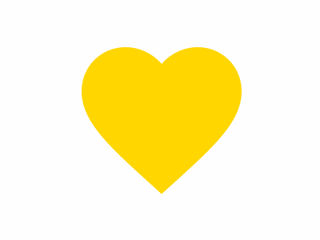

# SkiaSharp.Extended

[](https://www.nuget.org/packages/SkiaSharp.Extended)  [](https://www.nuget.org/packages/SkiaSharp.Extended)

**SkiaSharp.Extended** is a collection some cool functions that may be 
useful to some apps.

## SKGeometry

There are a few helper methods that can be used to create geometric 
shapes in the `SKGeometry` type:

 - `CreateSectorPath` - 
   creates a path with the shape of sector/section of a doughnut/pie 
   chart
 - `CreatePiePath` - 
   creates a path with the shape of a doughnut/pie chart
 - `CreateSquarePath` - 
   creates a path with the shape of a square
 - `CreateRectanglePath` - 
   creates a path with the shape of a rectangle
 - `CreateTrianglePath` - 
   creates a path with the shape of a triangle
 - `CreateRegularPolygonPath` - 
   creates a path with the shape of some regular polygon
 - `CreateRegularStarPath` - 
   creates a path with the shape of a square

Some of these shapes can also be draw directly on a `SKCanvas` 
using the extensions methods:

```csharp
SKCanvas canvas = ...

canvas.DrawStar(
    100, 100, // x, y
    100,      // outer radius
    50,       // inner radius
    5);       // points
```

## SKPathInterpolation

In addition to basic shapes, there is also a great way to create interpolated 
paths - this is awesome for creating animated shapes or transitions.

<center>



</center>

The code is also very simple, just create a `SKPathInterpolation` and then ask
for each step:

```csharp
var interpolation = new SKPathInterpolation(startPath, endPath);

var halfWayPath = interpolation.Interpolate(0.5f);
var almostTherePath = interpolation.Interpolate(0.9f);
```
